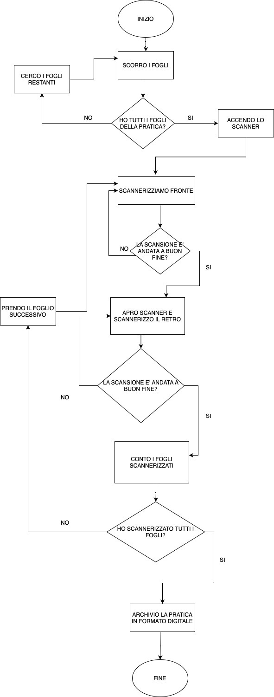

# Human Code

In questo esercizio il nostro team aveva l'obiettivo di analizzare e scomporre il problema e produrre un diagramma di flusso su una consegna assegnata.

### Descrizione esercizio

    Scansionare un documento su più fogli fronte-retro

    Finalmente sono riuscito a ritrovare quella pratica che sembrava essere svanita nel nulla! Che poi, possibile che nel 2023 ci siano ancora così tanti fogli di carta in giro per l’ufficio?! Ora ci penso io: una bella scansione e l’archiviamo in formato digitale, così la prossima volta so già dove andare a cercarla! L’unica pecca è che lo scanner non ha il fronte-retro automatico e mi tocca farlo a mano. Va beh, poco male, almeno sono pochi fogli!

## Pasaggi Chiave

Per raggiungere il nostro obiettivo, abbiamo seguito questi passaggi chiave:

- **Brainstorming**: Abbiamo partecipato ad una sessione di brainstorming per analizzare a fondo il problema. Abbiamo discusso delle sfide legate alla gestione dei documenti cartacei.

- **Creazione del Diagramma di Flusso**: Dopo il brainstorming, abbiamo creato un diagramma di flusso che rappresenta il processo completo per la scansione e l'archiviazione dei documenti cartacei. Il diagramma di flusso ci aiuterà a visualizzare chiaramente il percorso da seguire.

- **Esportazione del Diagramma in Formato Immagine**: Abbiamo esportato il diagramma di flusso in formato immagine (JPG). Questo ci ha consentito di condividerlo facilmente con il resto del team e con chiunque altro interessato.

## Diagramma di flusso

